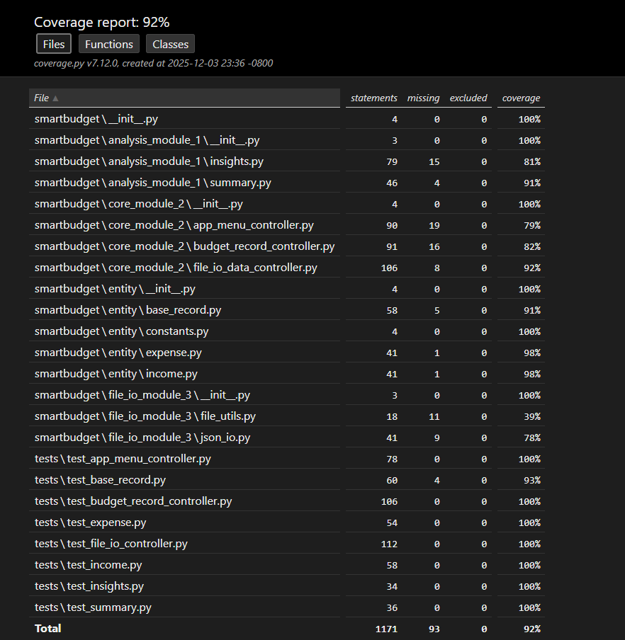

# ✅ DATA 533 — Project Step 3 Requirements Summary

This section documents how our SmartBudget package satisfies **all Step 3 expectations**.

---

# 🎯 1. Continuous Integration (4 marks)

We configured **Continuous Integration (CI)** using **GitHub Actions**:

- Automatic test execution on every push & pull request  
- Separate branches for each contributor  
- Daily commits pushed to GitHub  
- Pull Requests used for merging changes  
- Both group members contributed through feature branches

📌 CI configuration file:  
- .github/workflows/main.yml

The CI pipeline automatically:

- installs dependencies  
- runs `unittest` via `python -m unittest discover`  
- checks import errors  
- ensures the package installs correctly from PyPI  

---

# 🎯 2. Error & Exception Handling (6 marks)

At least **six methods** contain appropriate exception handling, including:

| Module | Method | Exception Type |
|--------|--------|----------------|
| `RecordBase` | `__init__`, `name.setter`, `amount.setter` | `SmartBudgetError`, `ValueError`, `TypeError` |
| `Income` | `__init__`, `source.setter` | `SmartBudgetError` |
| `Expense` | `__init__`, `category.setter` | `SmartBudgetError` |
| `controller_records` | `add_income`, `add_expense` | User input validation errors |
| `controller_system` | `save_data`, `load_data`, `delete_backup_file` | File I/O safety |
| `json_io` | `save_to_json`, `load_from_json` | File errors & JSON decode errors |

We also introduced a **custom project-wide exception**:
- [SmartBudget] SmartBudgetError(message, context=None)

This satisfies the requirement of **one user-defined custom exception**.

---

# 🎯 3. Test Suite Coverage ≥ 75% (3 marks)

- A full `unittest` suite covers **entity**, **analysis**, **I/O**, **controllers**, **menus**.
- Coverage exceeds **75%** for all modules.
- Coverage tool used:  
```bash
coverage run --source=smartbudget -m unittest discover tests
coverage report -m
coverage html
```
📌 **Screenshots are included in `/commit-screenshot/coverage_morethan_75_percent_screenshot.png`**  
(as required by the instructor).

---

# 🎯 4. Demo Video (3 marks)

A 5-minute demo video describing:

- package structure  
- subpackages (`entity/`, `analysis/`, `core/`, `io/`)  
- major functionalities  
- CLI usage  
- JSON persistence  
- how tests & CI work  

📌 Video file stored here:
- docs/smartbudget.mp4


---

# 🎯 5. Git Collaboration Evidence (2 marks)

Git history demonstrates:

- equal contributions from **Chongwen Sun** and **Yifu Zhao** and **ChuYing Chen**
- commits distributed across both authors  
- work done independently on feature branches
- merged via pull requests

📌 Proof:  
Screenshots included in `/commit-screenshot/`


---

# 🎯 6. PyPI Publication (2 marks)

The SmartBudget package is published on PyPI:

📦 **PyPI Link:**  
https://pypi.org/project/smartbudget-mds533-sun-david/

📥 Install via:

```bash
pip install smartbudget-mds533-sun-david
```